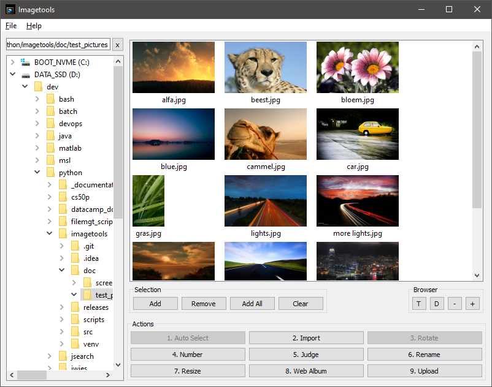

# Imagetools

A JPG photography workflow toolsuite.

## Description

Imagetools helps you perform the necessary photography workflow operations to manage your library efficiently through
various actions. All actions are accessible through the UI or via their own CLI.

| Action             | Description                                              | Supported in UI | Supported in CLI |
|--------------------|----------------------------------------------------------|:---------------:|:----------------:|
| Takeout            | Apply JSON metadata to google takeout images             |        ❌        |        ❌         |
| Flat to Tree       | Convert flat list of imagest to date-based hierarchy     |        ❌        |        ❌         |
| Heic to JPG        | Convert all heic in a folder into jpg & keep exif        |        ❌        |        ❌         |
| Exif to Mtime      | Modify Mtime with date taken from EXIF                   |        ❌        |        ❌         |
| Auto Select        | Auto select new images from a directory                  |        ❌        |        ❌         |
| Import             | Import from your SD card                                 |        ❌        |        ❌         |
| Make Sequential    | Force google to see name-based sequential order          |        ❌        |        ❌         |
| Seperate Video     | Seperate pictures from video files                       |        ❌        |        ❌         |
| Metadata Harvester | Overwrite downloaded google photos with correct metadata |        ❌        |        ❌         |
| Prefix Mtime       | Add the mtime as prefix to all filenames                 |        ❌        |        ❌         |
| Auto Rotate        | Auto rotate based on EXIF information                    |        ❌        |        ❌         |
| Number             | Number                                                   |        ❌        |        ❌         |
| Judge              | Select the best images from a series                     |        ❌        |        ❌         |
| Rename             | Number and rename                                        |        ❌        |        ❌         |
| Recursive Resize   | Recursively resize pictures                              |        ❌        |        ❌         |
| Resize             | Resize                                                   |        ❌        |        ❌         |
| Web Album          | Create a webalbum                                        |        ❌        |        ❌         |
| FTP upload         | Upload to an FTP webhost                                 |        ❌        |        ❌         |
| Cleanup            | Analyse and cleanup image folders                        |        ❌        |        ❌         |
| Archive            | Zip image folders                                        |        ❌        |        ❌         |

✅ Supported    
❌ Not supported

## Screenshot

[](docs/screenshots/v3.0/main_window.png)

## Changelog

See NEWS.md

## Windows user installation instructions

Download the installer from the 'release' folder, all dependencies are included.

## Windows developer instructions

The project comes with both a pyproject.toml and requirements.txt file.

### Installing using `uv` based on `pyproject.toml`

```commandline
uv install --dev
```

### Installing using `pip` based on `requirements.txt`

```commandline
python -m venv .venv
./bin/activate.bat
pip install -r requirements.txt
```

### Running the application

```commandline
(.venv) python src/imagetools.py 
```

### Running all the unit tests

From the project root directory, run

```commandline
python -m pytest
```

### Updating the dependencies (after adding new packages)

Adding new dependencies to the `pyproject.toml` file can be done using:

```commandline
uv add <package_name>
```

However, to keep requirements.txt up to date, you must also use:

```commandline
uv pip freeze > requirements.txt
```

### Building the windows installer

```commandline
pyinstaller imagetools.spec
```

## Author

Jorrit Vander Mynsbrugge