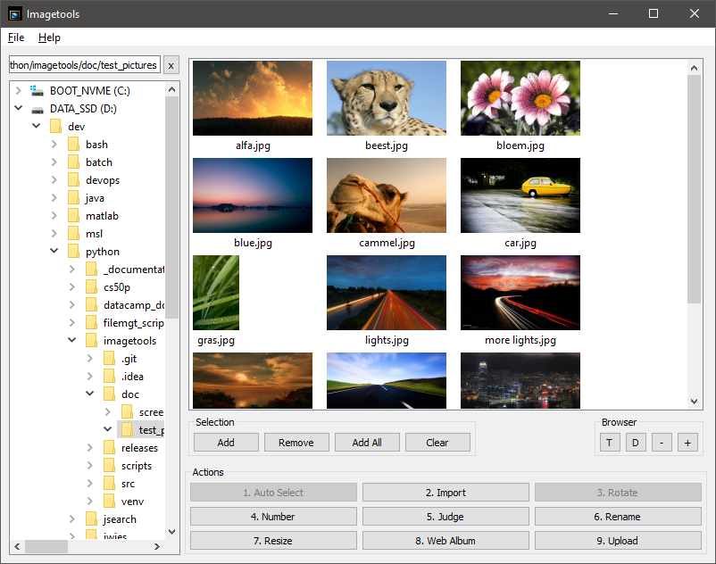

# Imagetools
A JPG photography workflow toolsuite.

## Description
When you take many pictures in JPG, Imagetools helps you perform the necessary workflow operations to get everything cleaned up efficiently. 

Supported operations:

* Import from your SD card
* Auto rotate based on EXIF information
* Select the best images from a series of similar ones
* Number and rename
* Resize
* Create a webalbum
* Upload it to an FTP webhost

## Screenshot
[](doc/screenshots/v3.0/main_window.png)

## Changelog
See NEWS.md

## Author
Jorrit Vander Mynsbrugge

## Windows user installation instructions
Download the installer from the 'release' folder, all dependencies are included.

## Windows developer installation instructions
```
python -m venv venv
./bin/activate.bat
pip install -r requirements.txt
python src/imagetools.py 
```

## Run all unit tests
From the src directory, run 
```
pytest test
```

## Building the windows installer
```commandline
pyinstaller imagetools.spec
```