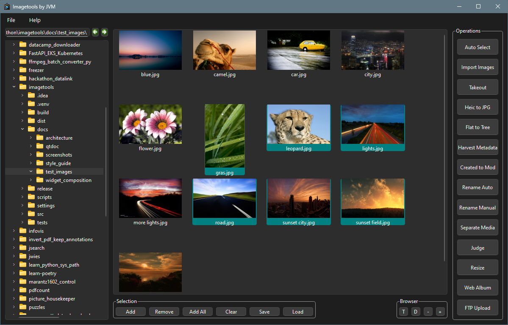

# Imagetools

A JPG photography workflow toolsuite.

TOC

## Description

Imagetools helps you perform the necessary photography workflow operations to manage your library efficiently.  
Operations are accessible through either the UI or via their own CLI or both.

| Action           | Description                                                       | Supported in UI | Supported in CLI |
|------------------|-------------------------------------------------------------------|:---------------:|:----------------:|
| Auto Select      | Auto select new images from a directory based on previous imports |        ✅        |        ❌         |
| Import           | Import selected images from your SD card into your library        |        ✅        |        ❌         |
| Takeout          | Extract Google takeout archives and apply JSON metadata           |        ✅        |        ✅         |
| Heic to JPG      | Convert all .heic files in a folder into .jpg & keep EXIF         |        ✅        |        ✅         |
| Flat to Tree     | Convert a flat list of imagest to a date-based folder hierarchy   |        ✅        |        ✅         |
| Separate Media   | Separate images from video files                                  |        ✅        |        ✅         |
| Harvest Metadata | Overwrite downloaded Google photos with correct metadata          |       ⚠️        |       ⚠️ ️       |
| Created to Mod   | Overwrite append and modified times with created times            |        ✅        |        ✅         |
| Rename Auto      | Automatically rename files using a template string                |        ✅        |        ✅         |
| Rename Manual    | Manually rename files efficiently                                 |        ✅        |        ❌         |
| Judge            | Select the best images from a series                              |        ✅        |        ❌         |
| Resize           | Resize images uniformly                                           |        ✅        |        ✅         |
| Web Album        | Create a web album                                                |        ✅        |        ❌         |
| FTP upload       | Upload a folder to an FTP server                                  |        ✅        |        ✅         |
| Archive          | Archive image folders into .zip files                             |        ❌        |        ✅         |
| Google Seq       | Make files appear in alphabetical order on google photos.         |        ❌        |        ✅         |
| Cleanup          | Analyse and cleanup image folders                                 |        ❌        |        ❌         |

✅ Supported    
⚠️ Warning  
❌ Not supported

## Screenshot

[](docs/screenshots/v4.0/main.png)

## Changelog

[See NEWS.md](NEWS.md)

## Developer instructions (windows)

The project comes with both a pyproject.toml and requirements.txt file.

### Cloning the repository

```commandline
git clone https://github.com/jorritvm/imagetools.git
cd imagetools
```

### Installing using `uv` based on `pyproject.toml`

Requires python 3.13.

```commandline
uv install --dev
```

### Installing using `pip` based on `requirements.txt`

```commandline
python -m venv .venv
./bin/activate.bat
pip install -r requirements.txt
```

### Running all the unit tests

From the project root directory, run

```commandline
python -m pytest
```

### Updating the dependencies (after adding new packages)

Adding new dependencies to the `pyproject.toml` file can be done using:

```commandline
uv add <package_name>
```

However, to keep requirements.txt up to date, you must also use:

```commandline
uv pip freeze > requirements.txt
```

### Building the windows installer

```commandline
pyinstaller imagetools.spec
```

## Installation instructions (windows)

If you do not want to build the application yourself, you can install the precompiled version.
Download the windows binaries from the 'release' folder, all dependencies are included.
Unzip the folder and run `imagetools_gui.exe` or `imagetools_cli.exe`.

## Usage instructions (windows)

### Running the CLI application

Get an overview of all available commands:

```commandline
(.venv) python src/imagetools_cli.py
```commandline
(.venv) python src/imagetools_cli.py -h 
```

Get more details on the arguments for a specific command:

```commandline
(.venv) python src/imagetools_cli.py <command> -h
```

### Running the UI application

```commandline
(.venv) python src/imagetools_ui.py 
```

## Author

Jorrit Vander Mynsbrugge