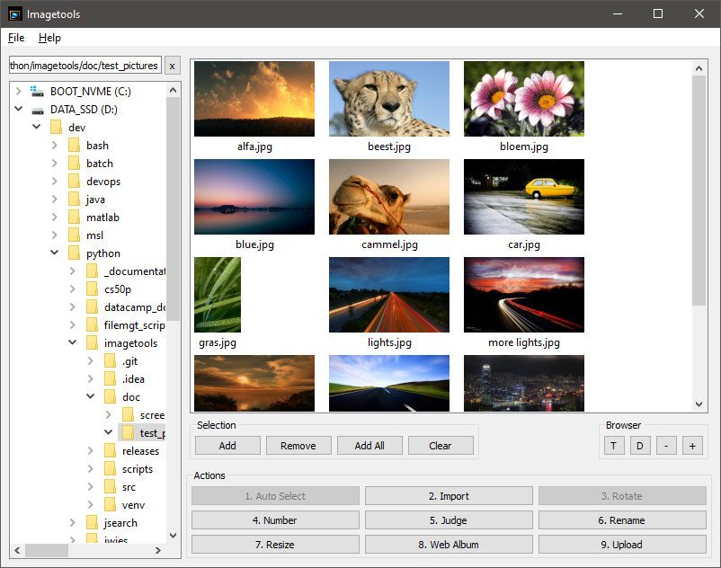

# Imagetools

A JPG photography workflow toolsuite.

## Description

Imagetools helps you perform the necessary photography workflow operations to manage your library efficiently through
various actions. All actions are accessible through the UI or via their own CLI.

| Action           | Description                                               | Supported in UI | Supported in CLI |
|------------------|-----------------------------------------------------------|:---------------:|:----------------:|
| Takeout          | Apply JSON metadata to google takeout images              |        ✅        |        ✅         |
| Heic to JPG      | Convert all .heic in a folder into .jpg & keep exif       |        ✅        |        ✅         |
| Flat to Tree     | Convert flat list of imagest to date-based hierarchy      |        ✅        |        ✅         |
| Harvest Metadata | Overwrite downloaded google photos with correct metadata  |       ⚠️        |       ⚠️ ️       |
| Created to Mod   | Overwrite append and modified times with created times    |        ✅        |        ✅         |
| Rename Auto      | Automatically rename files using a template string        |        ✅        |        ✅         |
| Rename Manual    | Manually rename files efficiently                         |        ✅        |        ❌         |
| Separate Media   | Separate images from video files                          |        ✅        |        ✅         |
| Judge            | Select the best images from a series                      |        ✅        |        ❌         |
| Resize           | Resize images uniformly                                   |        ✅        |        ✅         |
| Web Album        | Create a webalbum                                         |        ✅        |        ❌         |
| FTP upload       | Upload to an FTP webhost                                  |        ✅        |        ✅         |
| Archive          | Zip image folders                                         |        ❌        |        ✅         |
| Google Seq       | Make files appear in alphabetical order on google photos. |        ❌        |        ✅         |
| Auto Select      | Auto select new images from a directory                   |        ✅        |        ❌         |
| Import           | Import from your SD card                                  |        ✅        |        ❌         |
| Cleanup          | Analyse and cleanup image folders                         |        ❌        |        ❌         |

✅ Supported    
⚠️ Warning  
❌ Not supported

## Screenshot

[](docs/screenshots/v3.0/main_window.png)

## Changelog

See NEWS.md

## Windows user installation instructions

Download the installer from the 'release' folder, all dependencies are included.

## Windows developer instructions

The project comes with both a pyproject.toml and requirements.txt file.

### Installing using `uv` based on `pyproject.toml`

```commandline
uv install --dev
```

### Installing using `pip` based on `requirements.txt`

```commandline
python -m venv .venv
./bin/activate.bat
pip install -r requirements.txt
```

### Running the CLI application

Get an overview of all available commands:

```commandline
(.venv) python src/imagetools_cli.py
```commandline
(.venv) python src/imagetools_cli.py -h 
```

Get more details on the arguments for a specific command:

```commandline
(.venv) python src/imagetools_cli.py <command> -h
```

### Running the UI application

```commandline
(.venv) python src/imagetools_ui.py 
```

### Running all the unit tests

From the project root directory, run

```commandline
python -m pytest
```

### Updating the dependencies (after adding new packages)

Adding new dependencies to the `pyproject.toml` file can be done using:

```commandline
uv add <package_name>
```

However, to keep requirements.txt up to date, you must also use:

```commandline
uv pip freeze > requirements.txt
```

### Building the windows installer

```commandline
pyinstaller imagetools.spec
```

## Author

Jorrit Vander Mynsbrugge