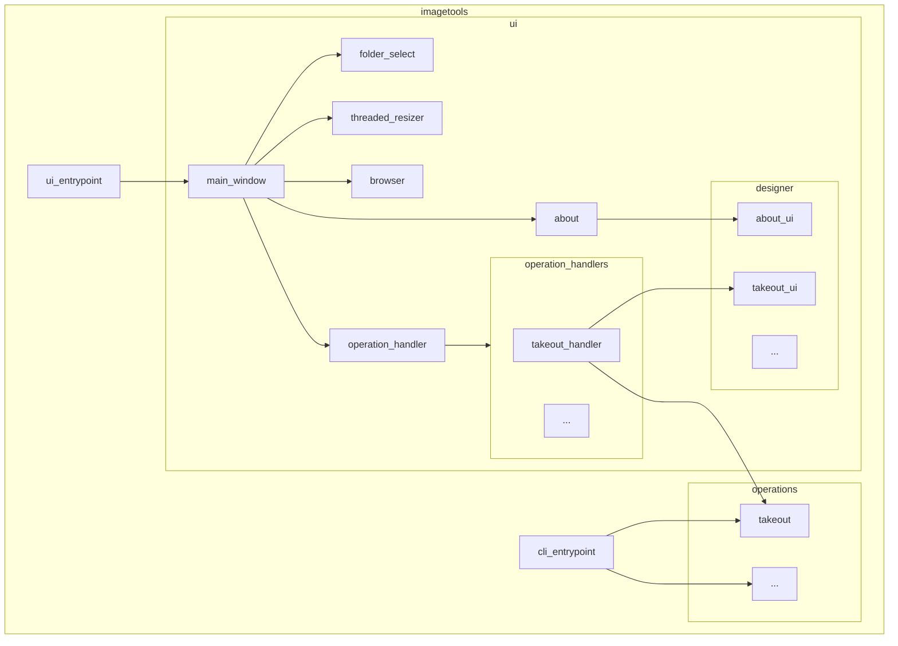

# Module view

```mermaid
flowchart TB
    subgraph imagetools
        

        %% Layout row for operations -> entrypoints -> ui
    
        direction LR
        subgraph operations
            takeout[takeout]
            ..1[...]
        end

        cli_entrypoint[cli_entrypoint]
        ui_entrypoint[ui_entrypoint]


        subgraph ui 
            subgraph designer
                about_ui
                takeout_ui
                ..2[...]
                end
                
            
            subgraph operation_handlers
                takeout_handler
                ..3[...]
                end
        
            main_window[main_window]
            folder_select[folder_select]
            browser[browser]
            threaded_resizer[threaded_resizer]
            operation_handler
            about
        end

        ui_entrypoint --> main_window
        cli_entrypoint --> takeout
        cli_entrypoint --> ..1

        main_window --> about
        about --> about_ui
        main_window --> folder_select
        main_window --> threaded_resizer
        main_window --> browser
        main_window --> operation_handler
        takeout_handler --> takeout_ui
        operation_handler --> operation_handlers
        takeout_handler --> takeout


end
```